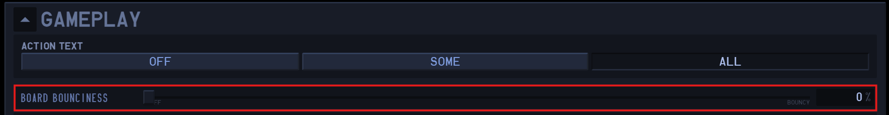
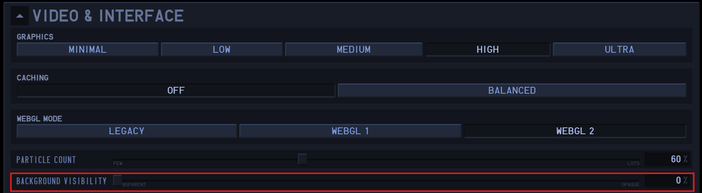
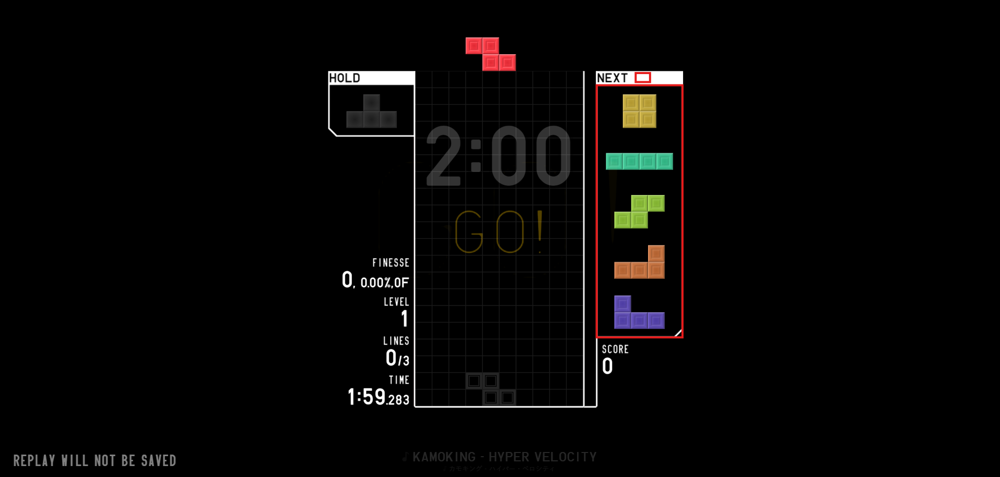
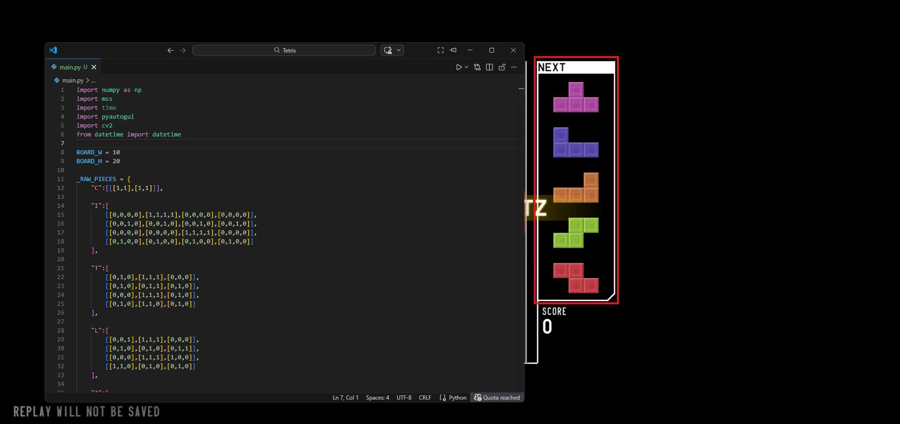
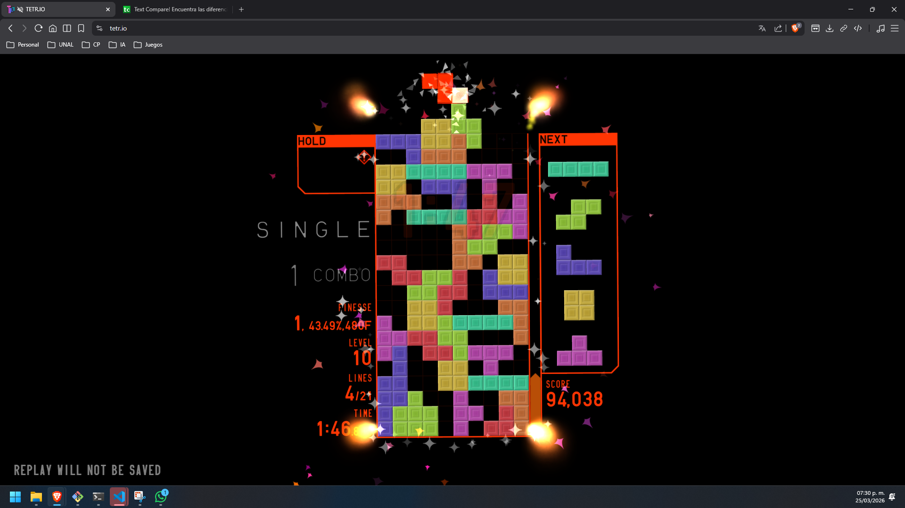

# Proyecto Tetris

## Grupo
Alejandro Ortiz

## Integrantes
Alejandro Ortiz Cortés - alortizco@unal.edu.co

## Configuraciones graficas Tetrio

Deben realizarse las siguientes configuraciones:





## Instrucciones de uso del agente

Instalar las librerías necesarias para la ejecución correcta del agente:

```
pip install numpy mss pyautogui opencv-python
```

Cuando se ejecuta el código, el programa da 5 segundos para cambiar de pestaña y enfocar el mapa de Tetr.io, en el cual se deben seleccionar las siguientes 2 áreas (primero la pequeña y después la grande):



Una vez seleccionadas, se imprimirán en consola las coordenadas de las áreas seleccionadas y terminará la ejecución del programa.

Ejemplo de coordenadas en consola:

```
Zona 1: {'top': 257, 'left': 3783, 'width': 33, 'height': 17}
Zona 2: {'top': 281, 'left': 3709, 'width': 160, 'height': 480}
{'d': {'top': 257, 'left': 3783, 'width': 33, 'height': 17}, 'n': {'top': 281, 'left': 3709, 'width': 160, 'height': 480}}
Guarde las zonas en la parte de abajo
```

Después de esto, se debe ir al código y comentar las líneas 311 - 315, las cuales son:

```
time.sleep(5)
self.zonas = self.calibrar_areas()
print(self.zonas)
print("Guarde las zonas en la parte de abajo")
self.listo = False
```

Se deben descomentar las líneas 317 - 319, las cuales son:

```
# self.zonas["d"] = {'top': 236, 'left': 1231, 'width': 25, 'height': 10}
# self.zonas["n"] = {'top': 256, 'left': 1155, 'width': 165, 'height': 497}
# self.listo = True
```

Los mapas "d" y "n" deben reemplazarse por los que se imprimieron en consola.

Si el agente no funciona despues de seleccionar el area de next, recalibre el area e intente de nuevo.

Después, debe posicionarse la ventana donde se ejecuta el código por encima de la pestaña de Tetr.io, de tal forma que no tape las zonas detectadas anteriormente, e inmediatamente cambiar a la pestaña de Tetr.io. El programa debe ejecutarse antes de que el modo Blitz comience; debe hacerse durante la cuenta regresiva.

Ejemplo:



El agente empieza a ejecutarse cuando sale la primera pieza del "next". Para saber que el agente está listo, debe imprimir en consola lo siguiente:

```
=== Tetris Agent ===
```

El agente siempre pierde la partida, pero antes de morir toma una captura de pantalla y la guarda con el nombre capturaH_M_S.png, donde:
* H = Hora
* M = Minuto
* S = Segundo

Ejemplo:

